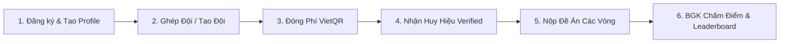

# 🏆 GEN-D ARENA 2026 — CẨM NANG HƯỚNG DẪN SỬ DỤNG VÀ VẬN HÀNH WEBSITE
> 📌 **Tài liệu chuẩn hoá dành cho:** Team Media, Ban Vận Hành, Ban Giám Khảo & Ban Tổ Chức (BTC)  
> 🌐 **Website cuộc thi:** Đấu Trường Khởi Nghiệp Công Nghệ Trẻ — GenD Arena 2026  
> 📄 **Bản trình bày tương tác Web / In PDF:** [`HUONG_DAN_SU_DUNG_WEBSITE.html`](file:///c:/Users/Quang%20Duy/Downloads/gendarena-page/HUONG_DAN_SU_DUNG_WEBSITE.html) *(Mở bằng trình duyệt Chrome/Edge)*  
> 📅 **Phiên bản:** v2.0 (Nâng cấp giao diện trực quan)  

---

## 📑 MỤC LỤC TRUY CẬP NHANH

- [1. Tổng Quan Dự Án & Định Vị Nền Tảng](#-1-tổng-quan-dự-án--định-vị-nền-tảng)
- [2. Sơ Đồ Quy Trình Thí Sinh Khép Kín](#-2-sơ-đồ-quy-trình-thí-sinh-khép-kín)
- [3. Phân Hệ Người Dùng & Thí Sinh (Participant Hub)](#-3-phân-hệ-người-dùng--thí-sinh-participant-hub)
  - [3.1. Đăng ký, Đăng nhập & Khôi phục mật khẩu](#31-đăng-ký-đăng-nhập--khôi-phục-mật-khẩu)
  - [3.2. Quản lý Hồ sơ cá nhân (Profile) & Tích xanh Verified](#32-quản-lý-hồ-sơ-cá-nhân-profile--tích-xanh-verified)
  - [3.3. Bảng điều khiển Đội thi & Ghép đội](#33-bảng-điều-khiển-đội-thi--ghép-đội)
  - [3.4. Đóng lệ phí dự thi VietQR & Cấp quyền Verified Team](#34-đóng-lệ-phí-dự-thi-vietqr--cấp-quyền-verified-team)
  - [3.5. Cổng nộp đề án & Pitch Deck các vòng](#35-cổng-nộp-đề-án--pitch-deck-các-vòng)
  - [3.6. Đăng ký sự kiện & Nhận vé QR Code](#36-đăng-ký-sự-kiện--nhận-vé-qr-code)
  - [3.7. Trung tâm thông báo & Fanpage hỗ trợ](#37-trung-tâm-thông-báo--fanpage-hỗ-trợ)
- [4. Phân Hệ Quản Trị Hệ Thống (Admin BTC Hub)](#-4-phân-hệ-quản-trị-hệ-thống-admin-btc-hub)
  - [4.1. Bảng điều khiển Tổng quan (Admin Hub)](#41-bảng-điều-khiển-tổng-quan-admin-hub)
  - [4.2. Quản lý & Phê duyệt Lệ phí dự thi](#42-quản-lý--phê-duyệt-lệ-phí-dự-thi)
  - [4.3. Quản lý Sự kiện, Webinar & Điểm danh QR](#43-quản-lý-sự-kiện-webinar--điểm-danh-qr)
  - [4.4. Cấu hình Lịch trình Vòng thi & Đóng/Mở cổng](#44-cấu-hình-lịch-trình-vòng-thi--đóngmở-cổng)
  - [4.5. Cấu hình Barem điểm & Trọng số chấm](#45-cấu-hình-barem-điểm--trọng-số-chấm)
  - [4.6. Quản lý Bài thi & Nhập điểm Giám khảo](#46-quản-lý-bài-thi--nhập-điểm-giám-khảo)
  - [4.7. Bảng tổng sắp xếp hạng Live Leaderboard](#47-bảng-tổng-sắp-xếp-hạng-live-leaderboard)
  - [4.8. Quản lý Người dùng, Diễn giả & Nhà tài trợ](#48-quản-lý-người-dùng-diễn-giả--nhà-tài-trợ)
- [5. Kịch Bản Vận Hành 5 Giai Đoạn Cuộc Thi (Playbook)](#-5-kịch-bản-vận-hành-5-giai-đoạn-cuộc-thi-playbook)
- [6. Cẩm Nang Xử Lý Sự Cố & Câu Hỏi Thường Gặp (FAQ)](#-6-cẩm-nang-xử-lý-sự-cố--câu-hỏi-thường-gặp-faq)
- [7. Bảng Tra Cứu Đường Dẫn (Sitemap URLs)](#-7-bảng-tra-cứu-đường-dẫn-sitemap-urls)

---

## 🌟 1. TỔNG QUAN DỰ ÁN & ĐỊNH VỊ NỀN TẢNG

### 🎯 1.1. Sứ mệnh cuộc thi
**GenD Arena 2026** là sàn đấu khởi nghiệp công nghệ bứt phá dành cho thế hệ Gen Z Việt Nam — kết nối các ý tưởng sáng tạo với mạng lưới cố vấn chuyên gia và các quỹ đầu tư mạo hiểm với tổng giá trị giải thưởng **100.000.000 VNĐ**.

### 👥 1.2. Ba đối tượng người dùng chính
| Vai trò | Ký hiệu | Đối tượng | Quyền hạn & Trải nghiệm chính |
| :--- | :---: | :--- | :--- |
| **Khách Vãng Lai** | `Guest` | Sinh viên, khách tham quan | Xem thể lệ, timeline, diễn giả, đối tác; đăng ký vé tham gia chuỗi Webinar/Workshop. |
| **Thí Sinh / Đội Thi** | `TS` | Sinh viên tham dự giải | Tạo/ghép đội, xác thực hồ sơ, đóng phí VietQR, nộp đề án & Pitch Deck qua các vòng. |
| **Ban Tổ Chức** | `BTC` | Ban điều hành, Giám khảo | Duyệt lệ phí, xuất data sự kiện, điểm danh QR, mở/đóng cổng thi, chấm điểm barem. |

> [!NOTE]
> Hệ thống áp dụng phong cách thiết kế **Cyberpunk Refined** tinh tế với gam màu Dark Navy (`#050814`, `#0F1F3D`) và điểm nhấn Cyan ánh sáng (`#00D4FF`, `#33E0FF`), mang lại trải nghiệm công nghệ vượt trội và hiện đại.

---

## 🔄 2. SƠ ĐỒ QUY TRÌNH THÍ SINH KHÉP KÍN



### 📋 Chi tiết 6 bước hành trình:
1. **Bước 1 — Mở tài khoản:** Đăng ký bằng Email hoặc Google OAuth 1 chạm, hoàn thiện hồ sơ nhận tích xanh.
2. **Bước 2 — Ghép đội thi:** Tạo đội mới để làm Trưởng nhóm hoặc tìm kiếm đội đang mở tại `/team/browse`.
3. **Bước 3 — Nộp lệ phí:** Quét mã VietQR tự động điền thông tin tài khoản MBBank và upload ảnh biên lai.
4. **Bước 4 — Xác thực:** BTC duyệt minh chứng $\rightarrow$ Đội nhận huy hiệu `Verified Team` và mở cổng nộp bài.
5. **Bước 5 — Nộp bài:** Tải file đề án (PDF/ZIP tới 50MB) cùng link Pitch Deck, Video Demo, Prototype Figma.
6. **Bước 6 — Xếp hạng:** Giám khảo chấm điểm theo barem $\rightarrow$ Hệ thống tự động tính điểm trung bình và vinh danh trên Leaderboard.

---

## 💻 3. PHÂN HỆ NGƯỜI DÙNG & THÍ SINH (PARTICIPANT HUB)

### 3.1. Đăng ký, Đăng nhập & Khôi phục mật khẩu
* 🔗 **Đăng ký (`/register`):** Hỗ trợ mật khẩu có thanh đo độ mạnh bảo mật hoặc Google Sign-in.
* 🔗 **Đăng nhập (`/login`):** Tự động chuyển hướng thông minh (`Admin` $\rightarrow$ `/admin`, `Thí sinh` $\rightarrow$ `/dashboard`).
* 🔗 **Quên mật khẩu (`/reset-password`):** Gửi email chứa link xác thực an toàn chuẩn PKCE.

---

### 3.2. Quản lý Hồ sơ cá nhân (Profile) & Tích xanh Verified
* 🔗 **Đường dẫn:** `/profile`
* **Thông tin định danh bắt buộc:** Họ và tên, Số điện thoại, Trường Đại học, Khoa/Viện, Chuyên ngành, Ngày sinh, Link Facebook cá nhân.
* **Lĩnh vực sở trường:** Gắn tag kỹ năng (AI/Dev, Business/Pitching, UI/UX Design, Marketing).

> [!TIP]
> **Quyền lợi tích xanh:** Khi điền đủ 100% hồ sơ, thí sinh sẽ nhận dấu tích xanh `Verified` cạnh tên trên Navbar, giúp hồ sơ nổi bật khi tìm đồng đội.

---

### 3.3. Bảng điều khiển Đội thi & Ghép đội
* 🔗 **Đường dẫn:** `/dashboard`

<details open>
<summary><b>👑 Dành cho Trưởng Nhóm (Team Leader)</b></summary>

- Tạo đội thi, chọn bảng đấu, thiết lập số lượng thành viên tối đa (3–5 người).
- Bật/Tắt công tắc `Cho phép tìm kiếm & xin gia nhập (is_open)`.
- Sao chép Link mời tham gia nhanh gửi cho bạn bè.
- Duyệt hoặc từ chối đơn xin gia nhập của ứng viên.
- Đổi tên đội, kích thành viên không hoạt động hoặc giải tán nhóm.
- Đại diện nhóm thực hiện đóng lệ phí thi.
</details>

<details open>
<summary><b>🤝 Dành cho Thành Viên Tự Do (Tìm đội)</b></summary>

- Truy cập `/team/browse` để xem danh sách tất cả các đội đang còn chỗ trống.
- Xem danh sách thành viên hiện có của từng đội để chọn nhóm phù hợp chuyên môn.
- Bấm **"Gửi yêu cầu gia nhập"** và theo dõi trạng thái được duyệt.
</details>

---

### 3.4. Đóng lệ phí dự thi VietQR & Cấp quyền Verified Team
* 🔗 **Đường dẫn:** Mở tại `/dashboard` hoặc `/submissions`
* **Quy trình đóng phí 4 bước tiện lợi:**
  1. Trưởng nhóm bấm **"Đóng lệ phí dự thi"** $\rightarrow$ Pop-up hiển thị mã **VietQR động**.
  2. Mã QR tự động điền STK Ngân hàng Quân Đội (MBBank), số tiền (100.000 VNĐ) và cú pháp chuẩn: `GENDARENA <TÊN_ĐỘI> <SĐT>`.
  3. Quét mã bằng app ngân hàng bất kỳ, chụp lại màn hình giao dịch thành công.
  4. Tải ảnh lên mục *Minh chứng chuyển khoản* và gửi xác thực.

> [!IMPORTANT]
> Sau khi BTC duyệt, toàn bộ thành viên trong đội sẽ nhận huy hiệu `Verified Team` màu xanh neon và mở khoá quyền nộp bài thi đề án.

---

### 3.5. Cổng nộp đề án & Pitch Deck các vòng
* 🔗 **Đường dẫn:** `/submissions` hoặc nút `Nộp bài` trên Navbar.
* **Nội dung bài nộp bao gồm:**
  - **Chọn vòng thi & chủ đề:** Vòng Sơ loại / Bán kết / Chung kết theo các Track (AI, FinTech, EdTech, GreenTech...).
  - **Tiêu đề & Tóm tắt đề án (Summary):** Giới thiệu giải pháp ngắn gọn từ 200–500 từ.
  - **Tệp tài liệu (Deliverable File):** Hỗ trợ `.pdf`, `.zip`, `.pptx`, `.docx` với dung lượng tối đa **50MB**.
  - **Liên kết trực tuyến:** Link Pitch Deck (Canva/Google Slides), Link Prototype Figma, Link Video Demo YouTube, Link GitHub Repository.
* **Lịch sử phiên bản:** Xem lại các bản nộp trước, tải file về máy và chỉnh sửa lại đề án trước thời điểm đóng cổng (Deadline).

---

### 3.6. Đăng ký sự kiện & Nhận vé QR Code
* 🔗 **Đường dẫn:** `/events` (Danh sách) và `/events/[id]` (Chi tiết sự kiện).
* **Quy trình nhận vé giữ chỗ:**
  - Xem thông tin diễn giả, khung giờ, địa điểm / link phòng họp Google Meet.
  - Bấm **"Đăng ký tham gia ngay"** $\rightarrow$ Hệ thống tự động phát hành **Vé điện tử (E-Ticket)**.
  - Mỗi vé có **Mã vé định danh** và **Mã QR Code độc quyền** phục vụ check-in tại cửa.
  - Hỗ trợ nút **"Thêm vào lịch"** để đồng bộ vào Google Calendar, Apple Calendar (.ics).

---

### 3.7. Trung tâm thông báo & Fanpage hỗ trợ
* 🔔 **Chuông thông báo (Navbar):** Nhận thông báo tự động khi được duyệt vào đội, lệ phí được xác thực, có kết quả chấm điểm hoặc có sự kiện mới.
* 💬 **Bong bóng Fanpage Facebook:** Nút tròn cố định góc phải màn hình, bấm vào dẫn ngay đến Fanpage chính thức để được hỗ trợ 24/7.

---

## 🛠️ 4. PHÂN HỆ QUẢN TRỊ HỆ THỐNG (ADMIN BTC HUB)

> [!CAUTION]
> Phân hệ chỉ dành cho tài khoản Ban Tổ Chức (`role = 'admin'`).

### 4.1. Bảng điều khiển Tổng quan (Admin Hub)
* 🔗 **Đường dẫn:** `/admin`
* **Chỉ số thời gian thực (Live Metrics):** Tổng số người dùng đăng ký, Số đội thi khởi tạo, Tổng số bài nộp, Số bài chờ chấm điểm.
* **Menu điều hướng 10 phân khu chức năng** giúp vận hành toàn diện cuộc thi.

---

### 4.2. Quản lý & Phê duyệt Lệ phí dự thi
* 🔗 **Đường dẫn:** `/admin/payments`
* **Thao tác nghiệp vụ:**
  - Bộ lọc theo tab: `Tất cả`, `Chờ duyệt (Pending)`, `Đã duyệt (Verified)`, `Bị từ chối (Rejected)`.
  - Bấm icon **Con mắt** để phóng to ảnh chụp biên lai giao dịch của đội thi.
  - Bấm **"Phê duyệt"** để cấp ngay quyền Verified cho đội thi và gửi thông báo chúc mừng.
  - Bấm **"Từ chối"** kèm lý do (Sai cú pháp, sai số tiền, ảnh mờ) để đội nộp lại biên lai mới.

---

### 4.3. Quản lý Sự kiện, Webinar & Điểm danh QR
* 🔗 **Đường dẫn:** `/admin/events`
* **Thao tác nghiệp vụ:**
  - Khởi tạo sự kiện mới: Đặt tên, phân loại (Webinar, Kickoff, Finale), thời gian, địa điểm/link online, số lượng vé tối đa.
  - Bấm **"Xuất danh sách đăng ký"** để tải file Excel/CSV gửi email nhắc lịch.
  - **Điểm danh (Check-in):** Quét mã QR trên vé của người tham dự hoặc tích chọn thủ công.

---

### 4.4. Cấu hình Lịch trình Vòng thi & Đóng/Mở cổng
* 🔗 **Đường dẫn:** `/admin/phases`
* **Thao tác nghiệp vụ:**
  - Tạo và sắp xếp các vòng thi (Sơ loại, Bán kết, Chung kết).
  - Công tắc **"Mở nhận bài (Submission Open)"**: Bật/Tắt thủ công hoặc hẹn ngày giờ đóng/mở tự động.
  - Công tắc **"Mở chấm điểm (Scoring Open)"**: Bật khi chuyển sang giai đoạn Ban giám khảo chấm bài.
  - Cấu hình định dạng bài nộp yêu cầu: Chỉ File, Chỉ Link, hoặc Cả File và Link.

---

### 4.5. Cấu hình Barem điểm & Trọng số chấm
* 🔗 **Đường dẫn:** `/admin/scoring`
* **Thao tác nghiệp vụ:**
  - Tạo Vòng chấm điểm (Scoring Round).
  - Thiết lập danh sách tiêu chí (Criteria) kèm **Trọng số (%)** và thang điểm tối đa.
  - Hệ thống tự động kiểm tra tổng trọng số đạt chuẩn 100%.
  - Đính kèm link **Rubric / Barem hướng dẫn chấm chuẩn** để Giám khảo tra cứu trực tiếp.

---

### 4.6. Quản lý Bài thi & Nhập điểm Giám khảo
* 🔗 **Đường dẫn:** `/admin/submissions`
* **Thao tác nghiệp vụ:**
  - Lọc bài thi theo Vòng thi, Chủ đề và Trạng thái chấm.
  - Tải file đề án gốc và mở các liên kết Pitch Deck / Video Demo của từng đội.
  - Nhập điểm chi tiết theo từng tiêu chí barem và nhập nhận xét của BGK.
  - Hệ thống tự động tính điểm trung bình tổng kết có nhân trọng số.

---

### 4.7. Bảng tổng sắp xếp hạng Live Leaderboard
* 🔗 **Đường dẫn:** `/admin/leaderboard`
* **Thao tác nghiệp vụ:**
  - Bảng tổng sắp xếp hạng thời gian thực dựa trên điểm số trung bình của Giám khảo.
  - Vinh danh Top 1 (Cúp Vàng), Top 2 (Huy chương Bạc), Top 3 (Huy chương Đồng).
  - Thanh năng lượng hiển thị trực quan mức độ cạnh tranh giữa các đội.

---

### 4.8. Quản lý Người dùng, Diễn giả & Nhà tài trợ
* 🔗 **Người dùng (`/admin/users`):** Tra cứu tài khoản theo tên/email/trường học; nâng quyền Admin hoặc chuyển về Thí sinh.
* 🔗 **Diễn giả & Cố vấn (`/admin/speakers`):** Thêm ảnh avatar, chức danh, đơn vị công tác, tiểu sử và link LinkedIn của Mentor/Judge.
* 🔗 **Nhà tài trợ & Đối tác (`/admin/sponsors`):** Quản lý logo và phân cấp tài trợ: Kim Cương (Platinum), Vàng (Gold), Bạc (Silver), Đồng hành (Partner).

---

## 🎬 5. KỊCH BẢN VẬN HÀNH 5 GIAI ĐOẠN CUỘC THI (PLAYBOOK)

```
┌─────────────────────────────────────────────────────────────────────────────────┐
│                           5 GIAI ĐOẠN VẬN HÀNH CHÍNH                             │
├─────────────────┬─────────────────┬─────────────────┬─────────────┬─────────────┤
│ GIAI ĐOẠN 1     │ GIAI ĐOẠN 2     │ GIAI ĐOẠN 3     │ GIAI ĐOẠN 4 │ GIAI ĐOẠN 5 │
│ Mở đơn & Ghép   │ Webinar &       │ Mở cổng nộp     │ Chấm điểm & │ Chung kết & │
│ đội (Tuần 1-3)  │ Workshop (T4-5) │ đề án (Tuần 6)  │ Bán kết(T7) │ Gala (T8)   │
└─────────────────┴─────────────────┴─────────────────┴─────────────┴─────────────┘
```

| Giai đoạn | Nhiệm vụ của Team Media & Ban Vận Hành |
| :--- | :--- |
| **G1: Mở đơn & Ghép đội** | • Đăng bài phát động kèm link `/register`.<br>• Điều phối thí sinh tìm bạn ghép nhóm tại `/team/browse`.<br>• Trực hòm thư duyệt lệ phí tại `/admin/payments` (duyệt trong vòng 2–4h). |
| **G2: Chuỗi Webinar** | • Tạo sự kiện tại `/admin/events`, giới hạn 300 vé để tạo hiệu ứng đăng ký sớm.<br>• Xuất data người đăng ký trước 60 phút để gửi email nhắc lịch phòng họp. |
| **G3: Nộp bài Sơ loại** | • Vào `/admin/phases` bật `Submission Open = ON` và hẹn giờ đóng cổng 23:59.<br>• Đăng bài đếm ngược (Countdown) nhắc các đội kiểm tra file trước hạn chót. |
| **G4: Chấm điểm & Bán kết**| • Bật cổng chấm điểm tại `/admin/scoring`.<br>• Nhập điểm giám khảo tại `/admin/submissions`.<br>• Lấy kết quả Top đội từ `/admin/leaderboard` để thiết kế ấn phẩm vinh danh. |
| **G5: Chung kết & Gala** | • Phát hành vé QR Code sự kiện Chung kết cho khách mời và cổ động viên.<br>• Chiếu trực tiếp màn hình Live Leaderboard trên sân khấu công bố Quán quân. |

---

## ❓ 6. CẨM NANG XỬ LÝ SỰ CỐ & CÂU HỎI THƯỜNG GẶP (FAQ)

### ❓ 1. Thí sinh không nhận được email đặt lại mật khẩu?
> **Giải pháp:** Hướng dẫn thí sinh kiểm tra mục *Thư rác (Spam)* hoặc tab *Quảng cáo (Promotions)* trong Gmail. Nếu dùng Gmail, có thể bấm nút **"Đăng nhập bằng Google"** để vào thẳng tài khoản.

### ❓ 2. Đã chuyển khoản nhưng hệ thống vẫn báo "Chờ duyệt" (Pending)?
> **Giải pháp:** Admin vào ngay `/admin/payments`, tìm tên đội hoặc số điện thoại trưởng nhóm, xem ảnh biên lai và bấm **"Phê duyệt"**. Sau đó bảo thí sinh tải lại trang (F5) là có ngay tích xanh.

### ❓ 3. Đội muốn đổi tên hoặc đổi thành viên thì làm thế nào?
> **Giải pháp:** Trưởng nhóm vào `/dashboard`, bấm icon cây bút cạnh tên đội để sửa tên, hoặc bấm icon thùng rác cạnh thành viên để kích và gửi link mời cho bạn mới (chỉ thực hiện trước giờ đóng cổng nộp bài).

### ❓ 4. File bài nộp báo lỗi quá dung lượng cho phép (>50MB)?
> **Giải pháp:** Nén file PDF qua công cụ iLovePDF hoặc tải file nặng lên **Google Drive** (đặt quyền *Ai có liên kết đều xem được*), sau đó dán link Drive vào ô *Liên kết đề án*.

### ❓ 5. Làm thế nào để lấy vé QR Code tham gia webinar / sự kiện?
> **Giải pháp:** Truy cập trang chi tiết sự kiện tại `/events/[id]`, màn hình sẽ hiển thị ngay tấm vé điện tử kèm mã QR Code để thí sinh chụp lại màn hình check-in.

---

## 🗺️ 7. BẢNG TRA CỨU ĐƯỜNG DẪN (SITEMAP URLS)

| Tên Phân Hệ | Đường Dẫn (URL) | Đối Tượng Sử Dụng |
| :--- | :--- | :--- |
| **Trang chủ** | `/` | Khách vãng lai & Thí sinh |
| **Đăng ký tài khoản** | `/register` | Thí sinh mới |
| **Đăng nhập** | `/login` | Tất cả người dùng |
| **Quên mật khẩu** | `/reset-password` | Khôi phục tài khoản |
| **Hồ sơ cá nhân** | `/profile` | Thí sinh & Admin |
| **Bảng điều khiển đội** | `/dashboard` | Thí sinh có tài khoản |
| **Khám phá & Tìm đội** | `/team/browse` | Thí sinh tìm nhóm |
| **Cổng nộp bài dự thi** | `/submissions` | Đội thi đã Verified |
| **Sự kiện & Vé điện tử** | `/events` | Khách & Thí sinh |
| **Ban tổ chức** | `/organizers` | Khách & Thí sinh |
| **Chính sách bảo mật** | `/privacy-policy` | Khách & Thí sinh |
| **Admin Hub tổng thể** | `/admin` | Ban Tổ Chức (BTC) |
| **Admin Duyệt lệ phí** | `/admin/payments` | Ban Tổ Chức (BTC) |
| **Admin Quản lý sự kiện** | `/admin/events` | Ban Tổ Chức (BTC) |
| **Admin Lịch trình & Cổng thi** | `/admin/phases` | Ban Tổ Chức (BTC) |
| **Admin Cấu hình barem** | `/admin/scoring` | Ban Tổ Chức (BTC) |
| **Admin Chấm bài thi** | `/admin/submissions` | Ban Tổ Chức & BGK |
| **Admin Bảng xếp hạng** | `/admin/leaderboard` | Ban Tổ Chức & BGK |
| **Admin Người dùng** | `/admin/users` | Ban Tổ Chức (BTC) |
| **Admin Diễn giả & Cố vấn** | `/admin/speakers` | Ban Tổ Chức (BTC) |
| **Admin Nhà tài trợ** | `/admin/sponsors` | Ban Tổ Chức (BTC) |

---

> 🔥 **Chúc Ban Tổ Chức và Team Media GenD Arena 2026 vận hành mùa giải thành công rực rỡ!**
